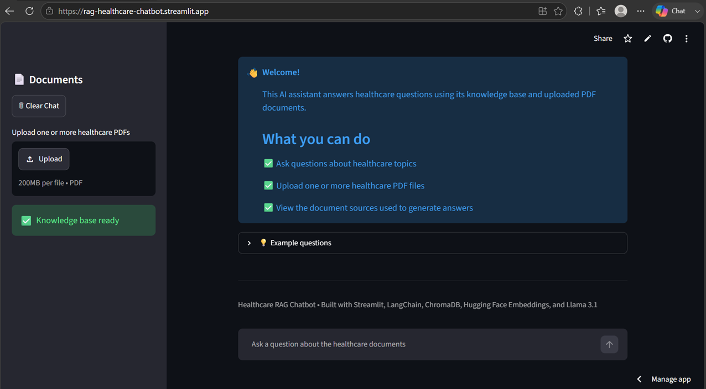
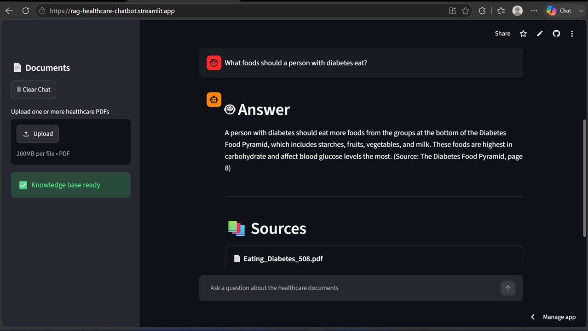
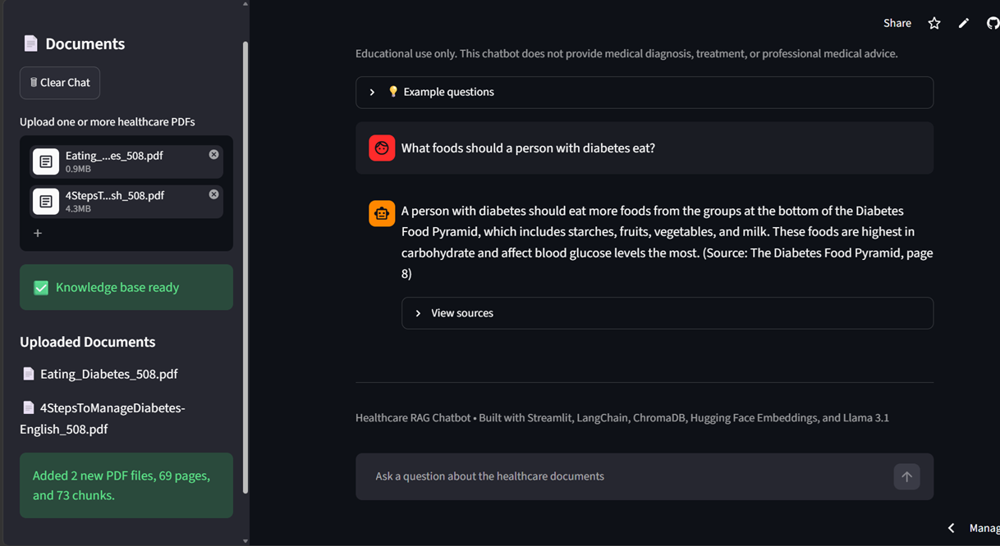

# 🩺 Healthcare RAG Chatbot

A Retrieval-Augmented Generation (RAG) chatbot that answers healthcare-related questions using trusted PDF documents. The application combines semantic search with a Large Language Model (LLM) to generate accurate, context-aware responses while citing the source documents used.

> ⚠️ **Disclaimer:** This project is intended for educational and demonstration purposes only. It does not provide medical diagnosis, treatment, or professional healthcare advice.

---

## 🚀 Live Demo

**Streamlit App:**  
https://your-streamlit-url.streamlit.app

**GitHub Repository:**  
https://github.com/salehpour1367/rag-healthcare-chatbot

---

## 📸 Screenshots

### Home Page




---

### Ask a Question

> Example: "What foods should a person with diabetes eat?"



---

### Upload PDF



---

# 📖 Project Overview

Healthcare professionals and students often need quick access to reliable information from medical documents.

Instead of searching through hundreds of pages manually, this chatbot retrieves the most relevant document sections using semantic search and generates answers based only on the retrieved context.

The chatbot also supports uploading additional healthcare PDFs, allowing users to extend the knowledge base without modifying the code.

---

# ✨ Features

- Semantic search using sentence embeddings
- Retrieval-Augmented Generation (RAG)
- Built-in healthcare knowledge base
- Upload one or multiple PDF documents
- Automatic PDF processing
- Source citation with page numbers
- Conversation history
- Duplicate PDF detection
- Streamlit web interface
- Cloud deployment

---

# 🏗 Architecture

```
                  User
                    │
                    ▼
           Streamlit Interface
                    │
                    ▼
          User Question / PDF Upload
                    │
                    ▼
      HuggingFace Embeddings
                    │
                    ▼
             Chroma Vector DB
                    │
          Similarity Search
                    │
                    ▼
      Retrieved Document Chunks
                    │
                    ▼
        Llama 3.1 (Inference API)
                    │
                    ▼
          Final Answer + Sources
```

---

# 🛠 Technologies

- Python
- Streamlit
- LangChain
- ChromaDB
- HuggingFace Embeddings
- Hugging Face Inference API
- Meta Llama 3.1 8B Instruct
- PyPDFLoader
- RecursiveCharacterTextSplitter

---

# 📂 Project Structure

```
rag-healthcare-chatbot/
│
├── app.py
├── requirements.txt
├── README.md
│
├── chroma_db/
│
├── data/
│   ├── pdfs/
│   └── uploads/
│
└── images/
```

---

# ⚙️ Installation

Clone the repository:

```bash
git clone https://github.com/salehpour1367/rag-healthcare-chatbot.git
cd rag-healthcare-chatbot
```

Create a virtual environment:

```bash
python -m venv venv
```

Activate it.

Windows

```bash
venv\Scripts\activate
```

macOS/Linux

```bash
source venv/bin/activate
```

Install dependencies:

```bash
pip install -r requirements.txt
```

Create a `.streamlit/secrets.toml` file:

```toml
HF_TOKEN="your_huggingface_token"
```

Run the application:

```bash
streamlit run app.py
```

---

# 💬 Example Questions

- What foods should a person with diabetes eat?
- What is the Diabetes Plate Method?
- Which foods contain carbohydrates?
- What drinks are recommended for people with diabetes?
- What are healthy snack options?

---

# 📚 How It Works

1. User enters a healthcare question.
2. The question is converted into an embedding.
3. ChromaDB retrieves the most relevant document chunks.
4. The retrieved context is sent to Llama 3.1.
5. The LLM generates an answer using only the retrieved information.
6. The application displays the answer together with the document sources.

---

# 📌 Future Improvements

- Support additional medical document collections
- OCR support for scanned PDFs
- User authentication
- Conversation export
- Feedback and rating system
- Hybrid search (keyword + semantic)

---

# 👨‍💻 Author

**Simintaj Salehpour**

M.S. Data Science  
George Washington University

GitHub:

https://github.com/salehpour1367

---

# 📄 License

This project is licensed under the MIT License.
